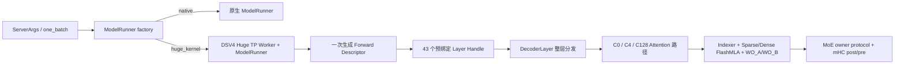

# DeepSeek V4 Flash / SGLang Huge Kernel 端到端优化总结

日期：2026-08-10  
状态：优化已暂停；代码、benchmark 原始数据、NCU/NSYS 和 Git 历史已冻结。

## 1. 执行摘要

本轮工作的核心不是把整层强行合并为一个物理 CUDA kernel，而是先在 SGLang 中建立一个严格、无回退的整层执行边界，再沿着真实端到端瓶颈逐步扩大 GPU 侧优化空间：批次元数据只生成一次、workspace 常驻、C4 Indexer/Attention/WO 按 TP4 切分、通信载荷压缩、MoE 同步转移到 GPU、最后再做 FlashMLA 内部延迟隐藏和高负载专家布局。

最终推荐的是按 workload 显式选择的组合版本：

- Req=16：v70h identity placement，commit/tag `259eb32b8` / `dsv4_huge_eager_req16_req128_v70h_separate_moe_checkpoint_20260810`。
- Req=128：v70j layer-42 swap5，commit/tag `20148a8c4` / `dsv4_huge_eager_req128_v70j_checkpoint_20260810`。
- 两者都为 Eager Prefill，CUDA Graph 关闭；不存在自动回退到 Native 的路径。

### 1.1 当前正式性能

| Case | 每请求 cached/new | Native 5 次 TTFT (ms) | Native 中位数 | Huge 5 次 TTFT (ms) | Huge 中位数 | TTFT 降低 | 加速比 | 新 token 吞吐 Native → Huge |
|---|---:|---|---:|---|---:|---:|---:|---:|
| Req=16 | 16384 / 4096 | 1040.5, 1029.3, 1028.4, 1030.2, 1027.2 | 1029.3 ms | 681.4, 681.2, 680.4, 680.6, 679.6 | **680.6 ms** | **33.88%** | **1.512×** | 63.67K → 96.29K token/s |
| Req=128 | 16384 / 4096 | 8327.2, 8290.1, 8763.0, 8325.1, 8284.9 | 8325.1 ms | 5463.7, 5450.5, 5475.7, 5433.8, 5433.2 | **5450.5 ms** | **34.53%** | **1.527×** | 62.98K → 96.19K token/s |

Req=16 一次处理 `M=16×4096=65536`。Req=128 为四个 Req=32 wave，每个 wave `M=32×4096=131072`，总新增 token 为 524288；4096 是每一个请求的新增 token 数，不是整个 batch 的总量。

最新 Native 与最终 Huge 都有完整的 5 次 endpoint 原始样本，但不是逐对交替采样。B300 节点存在抖动，因此上表适合作为当前版本汇总，不把小于约 0.5% 的差异解释成稳定收益。最终两个大 workload 的 1.51–1.53× 差距远大于该噪声范围。

## 2. 测试边界与环境

### 2.1 硬件与模型

- 主机：B300-M3，节点有 8× NVIDIA B300 SXM6 AC；实验使用其中 4 卡。
- GPU：SM103 / compute capability 10.3，单卡 275040 MiB，driver 610.43.02。
- 并行：TP4、EP4、DP1、PP1、CP1、DCP1。
- 模型：`/mnt/b300-shared/models/DeepSeek-V4-Flash`。
- SGLang 工作树：`/mnt/b300-shared/home/gjy/sglang_huge/.runtime/moe_mhc_v37_worktree`。
- 当前 HEAD：`20148a8c44e9d28cbe3070e009213e5712556337`。
- 当前分支：`dsv4_huge_eager_req16_req128_v70k_moe_barrier_work_20260810`；HEAD 实际固定在已接受的 v70j checkpoint，未包含后来未完成的 v76 构建。

### 2.2 固定服务配置

- `--dsv4-worker-backend {native,huge_kernel}`，默认 `native`。
- Huge 使用 `attention-backend=dsv4`、`moe-runner-backend=flashinfer_mxfp4`。
- context capacity 73728，page size 256，output length 1。
- Eager 正式链关闭 overlap、decode graph 和 prefill graph。
- Huge 只接受 DeepSeek V4 Flash 的精确结构、B200/SM100 或 B300/SM103、TP4/EP4、EXTEND/Prefill。
- 不支持 decode、speculative、TBO、LoRA、offload、HiSparse 等模式；非法配置直接报错。
- 每请求 EXTEND 上限 4096；Req=128 的 Eager 聚合 bucket 为 M=131072。

模型的 `compress_ratio` 是逐层属性，不是部署前设置一个全模型统一值。43 层固定为：2 层 C0、21 层 C4、20 层 C128，对应 `(0, 0) + (4, 128) × 20 + (4,)`。

## 3. SGLang 整层接入结构



整层 executor 是一个优化与资源管理边界，不代表整层只有一次 kernel launch。Tensor Core GEMM、FlashMLA、MoE GEMM 和跨卡通信仍保留必要的物理边界；收益来自取消重复计算、降低通信字节、减少中间张量和 Host 同步，并把跨模块控制逐步迁移到 GPU。

### 3.1 关键接入文件

| 文件 | 作用 |
|---|---|
| `python/sglang/srt/server_args.py` | 定义 `--dsv4-worker-backend {native,huge_kernel}`；Native/Huge 显式选择。 |
| `python/sglang/srt/model_executor/model_runner_factory.py` | Server 与 standalone benchmark 共用 ModelRunner factory，避免 `one_batch` 绕过 Worker 选择。 |
| `python/sglang/srt/managers/dsv4_huge_kernel_tp_worker.py` | DSV4 专用 TP Worker；不是 huge 配置时拒绝构造。 |
| `python/sglang/srt/model_executor/dsv4_huge_kernel_model_runner.py` | 严格静态/动态支持矩阵、ForwardBatch 校验、GPU descriptor 生命周期及 Graph bucket 约束。 |
| `python/sglang/srt/model_executor/dsv4_huge_kernel_whole_layer_runner.py` | 单层入口，连接 DecoderLayer 与整层 runtime。 |
| `python/sglang/srt/models/deepseek_v4.py` | `_forward_native` 与 Huge 整层分发边界；权重与专用路径绑定。 |
| `python/sglang/srt/models/dsv4_whole_layer_runtime.py` | `DSV4ForwardDescriptor`、43 层 handle、常驻 workspace、TP4 对称内存、GPU owner/epoch 状态和整层调度。 |
| `python/sglang/srt/layers/attention/deepseek_v4_backend.py` | C0/C4/C128、TP4 token shard、peer-Q FlashMLA 与输出路径选择。 |
| `python/sglang/srt/layers/attention/dsv4/indexer.py` | C4 Indexer、TP4 query shard、combined-only TopK 接入。 |
| `python/sglang/srt/layers/attention/dsv4/sparse_prefill_utils.py` | 页式 sparse prefill 元数据及 GPU workspace 复用。 |
| `python/sglang/jit_kernel/dsv4/e2e.py` | mHC、WO、TP4 reduce/push/gather、MoE owner 等 CUDA custom-op 的 Python 薄封装。 |
| `python/sglang/jit_kernel/dsv4/clustered_mqa_logits.py` | Clustered MQA logits 与 combined TopK。 |
| `python/sglang/jit_kernel/csrc/dsv4/clustered_mqa_logits/v2_kernel.cu` | C4 MQA/TopK CUDA 实现。 |
| `python/sglang/jit_kernel/csrc/deepseek_v4/inverse_rope_fp8_wo_a.cuh` | inverse-RoPE、FP8 quant、WO_A 输入布局融合。 |
| `python/sglang/jit_kernel/csrc/deepseek_v4/tp4_nccl_bf16_reduce.cuh` | WO_B reduce 与 direct GPU push/gather、ready epoch。 |
| `python/sglang/jit_kernel/csrc/deepseek_v4/tp4_moe_mhc_post.cuh` | TP4 MoE owner reduce、GPU barrier/epoch、mHC post。 |
| `python/sglang/jit_kernel/csrc/deepseek_v4/topk_v2.cuh` | 高负载 TopK histogram 专门化。 |
| `python/sglang/jit_kernel/csrc/deepseek_v4/mhc_pre_norm_mxfp8_quant.cuh` | mHC pre、RMSNorm 与后续 MXFP8 quant 融合。 |
| `sgl-kernel/cmake/patches/flashmla-sm100-head64-tp4-token-shard-v6-uniform-rescale.patch` | TP4 token-sharded FlashMLA 与 uniform rescale。 |
| `sgl-kernel/cmake/patches/flashmla-sm100-head64-tp4-peer-q-v30b.patch` | FlashMLA 直接读取对称 peer Q。 |
| `python/sglang/benchmark/generate_dsv4_huge_static_expert_map.py` | v70j workload-specific expert placement 生成器。 |

测试与复现入口主要位于 `scripts/dsv4_e2e/`、`python/sglang/benchmark/one_batch_server.py`、`test/registered/unit/model_executor/` 和 `test/registered/jit/`。

## 4. 端到端优化路径

### 4.1 完整 Eager 里程碑表

下表中的 “vs Native” 使用 2026-08-10 最新 Native 中位数做统一参照，便于观察累计幅度；中间版本来自不同测试窗口，因此小幅差异应结合相邻 A/B 与 NSYS 判断。m131 行使用 v5 正式 A/B 中的 control 中位数 947.3/7611.7；另一次独立冻结值为 945.0/7596.3 ms。

| 版本 | Req16 TTFT | vs Native | Req128 TTFT | vs Native | 主要加速原因 |
|---|---:|---:|---:|---:|---|
| Native（新基线） | 1029.3 | 1.000× | 8325.1 | 1.000× | 原生 SGLang 路径。 |
| m131 Huge 基线 | 947.3 | 1.087× | 7611.7 | 1.094× | 严格整层 Worker/executor；descriptor 和 workspace 复用；Q-LoRA quant、TopK、mHC 基础融合。 |
| v5 | 923.3 | 1.115× | 7351.3 | 1.132× | C4 sparse attention 按 token 在 TP4 切分，取消 3/4 重复 attention 计算。 |
| v6 | 916.6 | 1.123× | 7292.3 | 1.142× | FlashMLA 内部统一 rescale vote，跳过 inactive rescale。 |
| v8 | 906.0 | 1.136× | 7228.0 | 1.152× | attention 输出在跨卡交换前量化为 FP8，通信行宽约减半。 |
| v9 | 902.4 | 1.141× | 7219.3 | 1.153× | WO_A 直接消费 packed FP8，只转置 64-byte scales，删除 8192-byte Q copy。 |
| v12 | 894.0 | 1.151× | 7145.1 | 1.165× | C4 交换移动到 WO_A 后的压缩中间表示。 |
| v13 | 892.3 | 1.154× | 7131.7 | 1.167× | scale unpack 向量化。 |
| v15 | 888.4 | 1.159× | 7090.1 | 1.174× | interleaved direct GPU push，减少 Host/NCCL 编排。 |
| v16 | 878.6 | 1.172× | 7028.8 | 1.184× | C4 WO_B reduce/quant 本地化、融合并预分配。 |
| v17 | 875.7 | 1.175× | 7006.0 | 1.188× | 输出 AllGather 替换为 direct GPU push。 |
| v21 | 867.4 | 1.187× | 6975.0 | 1.194× | 对称 Q buffer、bulk route、跳过 local quarter、每 CTA 三条 peer link。 |
| v22 | 791.6 | 1.300× | 6327.4 | 1.316× | **TP4 Indexer sharding**；Indexer 不再四卡重复，单步最大收益。 |
| v24 | 788.5 | 1.305× | 6326.5 | 1.316× | combined-only TopK，删除 raw/page index 中间结果与后续 gather。 |
| v28 | 745.6 | 1.380× | 5971.3 | 1.394× | TP4 attention sharding 从 C4 扩展到 C0/C128，全压缩率覆盖。 |
| v29 | 740.8 | 1.389× | 5944.8 | 1.400× | WO_B reduce 与输出 gather 融合。 |
| v30b | 706.2 | 1.458× | 5673.8 | 1.467× | Sparse FlashMLA 直接读取对称 peer Q，tile64；删除显式 Q 汇聚边界。 |
| v39f | 703.5 | 1.463× | 5664.0 | 1.470× | MoE owner 协议，Host 中间 barrier 迁移到 GPU。 |
| v42 | 686.0 | 1.500× | 5520.2 | 1.508× | owner post 每四 token 摊销一次 T4/同步成本。 |
| v48c | 685.1 | 1.502× | 5509.7 | 1.511× | 等待 `bar_sv_done` 时预取首个 64-column K tile。 |
| v56-LB4C | 681.0 | 1.511× | 5487.4 | 1.517× | 4-CTA launch-bounds owner post，提高可驻留性/并发度。 |
| v59b | 680.8 | 1.512× | 5476.5 | 1.520× | leader-only owner epochs，减少重复轮询。 |
| v70b | 681.1 | 1.511× | 5490.6 | 1.516× | Req128 高负载 11-bin TopK histogram。 |
| v70e | 681.2 | 1.511× | 5470.5 | 1.522× | owner-ready WO_B pipeline 扩展到 Req128。 |
| v70h | **680.6** | **1.512×** | 5462.3 | 1.524× | MoE partial 使用独立对称 workspace，降低资源冲突。 |
| 推荐组合 | **680.6** | **1.512×** | **5450.5** | **1.527×** | Req16 保留 v70h identity；Req128 叠加 v70j layer42 专家映射。 |

从 m131 paired control 到推荐版本，Req16 由 947.3 降至 680.6 ms（-28.15%），Req128 由 7611.7 降至 5450.5 ms（-28.39%）。相对于最新 Native，则分别达到 1.512× 和 1.527×。

### 4.2 为什么这些策略有效

1. **先消除重复计算，再抠单 kernel。** v22 Indexer TP4 sharding 和 v28 全 ratio attention sharding贡献最大。原路径在每张 TP 卡上重复处理完整 token 集；切分后每卡只做所有权范围内的工作。
2. **通信优化的关键是缩小跨卡状态。** v8 将 BF16 attention 输出先量化成 packed FP8；v12 把交换边界推到 WO_A 后；v17/v29 用直接 push 和 fused reduce/gather 消除中间物化。
3. **整层 executor 让 workspace 和状态跨算子复用。** descriptor 每 batch 构建一次，43 层共享；Q buffer、combined indices、MoE partial、epoch/ready state 常驻 GPU，避免逐层分配、`.item()`/`.tolist()` 和 Host 拼接。
4. **GPU 本地同步只在协议足够轻时获益。** v39f/v42/v59b 的 owner/leader 协议有效；相反，持久 polling、额外 shared atomics 或重复索引加载会把省掉的 Host 边界重新变成 GPU stall。
5. **内部优化必须在端到端 profile 下验收。** v48c 单 kernel 仅提升 1.48%，但在 Req128 全局 NSYS 中 sparse FlashMLA aggregate 仍降低 0.81%，最终获得约 0.26% E2E；v72/v74 虽提高部分 cache 指标，却因指令和加载增加而失败。
6. **高负载需要 workload-specific 策略。** Req16 是一个 M65536 wave，Req128 是四个 M131072 wave，MoE expert 分布和同步尾部不同。最终显式保留两个 preset，而不是在运行时猜测或自动回退。

## 5. CUDA Graph 历史分支

Graph 最佳代码保留在 commit `b2f93df6a87a7ec97f4f181875676d13a92e02ad`、branch `dsv4_huge_graph_best_20260807`，没有被 Eager 迭代覆盖。

### 5.1 Req=1，cached=65536/new=4096

| 版本 | TTFT (ms) | 相对 Native Graph |
|---|---:|---:|
| Native Eager | 171.9 | — |
| Native Graph | 116.3 | 1.000× |
| Huge Graph 初版 | 115.9 | 1.003× |
| Huge single-segment | 103.2 | 1.127× |
| Huge fused C128 | 102.8 | 1.131× |
| Huge fused core | **102.45** | **1.135×** |

### 5.2 Req=16，cached=16384/new=4096

| 版本 | TTFT (ms) | 相对 Native Graph |
|---|---:|---:|
| Native Graph | 1107.0 | 1.000× |
| Huge compact | 1045.8 | 1.059× |
| Huge warp-bitset L0 | 1023.0 | 1.082× |
| Huge FlashMLA output-only | 971.8 | 1.139× |
| Huge local16 | **962.5** | **1.150×** |

Graph 数字来自较早 commit，不能与当前 Eager v70h/v70j 做“只差一个 Graph 开关”的因果比较。当前 Eager 已吸收大量后续 TP4、peer-Q 与 MoE 改造；正确的下一步应是把 Graph 支持重建在当前最佳 Eager 上，而不是用旧 Graph 分支替代当前最佳版本。Req128 尚无正式 Graph benchmark。

## 6. NSYS 全局证据

### 6.1 关键可量化转折

| 对比 | Case | kernel 数 | summed GPU time / span 变化 | 关键模块变化 | 结论 |
|---|---|---:|---|---|---|
| m131 → v5 | Req16 | 6864 → 7032 | 3522.613→3435.880 ms；span 899.236→877.763 ms | sparse attention 851.750→511.980 ms；NCCL 616.236→875.828 ms | 多 168 次通信 kernel，但取消重复 attention 后净赢 21.47 ms span。 |
| m131 → v5 | Req128 | 28240 → 28912 | 28256.072→27170.189 ms；span 7212.482→6941.873 ms | sparse attention 6885.549→4123.815 ms；NCCL 5015.025→6739.590 ms | 多 672 次通信 kernel，仍净赢 270.61 ms span。 |
| v5 → v6 | Req16 | 7032 → 7032 | 3435.880→3394.181 ms；span -10.343 ms | sparse attention -23.939 ms | launch 数不变，证明收益来自 FlashMLA 内部控制优化。 |
| v5 → v6 | Req128 | 28912 → 28912 | 27170.189→26993.316 ms；span -46.388 ms | sparse attention -168.605 ms | 同上。 |
| v6 → v8 | Req16 | 7032 → 7116 | 3394.181→3351.031 ms；span -10.381 ms | SendRecv 264.965→205.845 ms | 多一个 pack/unpack 边界仍因载荷减半而净赢。 |
| v6 → v8 | Req128 | 28912 → 29248 | 26993.316→26721.216 ms；span -71.678 ms | SendRecv 1946.295→1540.088 ms | 通信字节下降主导。 |
| v8 → v9 | Req16 | 7116 → 7116 | span 857.039→854.908 ms | unpack 13.565→6.104 ms | 直接消费 packed Q，删除大拷贝。 |
| v8 → v9 | Req128 | 29248 → 29248 | span 6823.807→6811.461 ms | unpack 107.381→48.247 ms | WO_A 时间基本不变，收益来自 scale-only unpack。 |
| v30b → v48c | Req128 | sparse 688 calls | sparse sum 2439.996→2420.311 ms | -0.81% | K 首 tile 预取在完整 E2E 中可见。 |
| v70i → v70j | Req128 | 32016 → 32016 | GPU envelope 5064.063→5040.592 ms；summed 19689.563→19593.525 ms | MoE barrier 1348.923→1275.294 ms | kernel 数不变；layer42 专家布局降低 barrier 尾部。 |

最终 Req128 仍有 32016 次 kernel launch。说明整层执行边界已经建立，但物理 kernel 数尚未收敛到理想状态；后续仍有融合空间，尤其是 MoE 前后、ready/epoch 和较小 elementwise 边界。

### 6.2 Native NSYS 可比性说明

早期 Native NSYS 曾出现只覆盖部分 EP rank/进程的采集问题，因此本报告**没有**用那份 profile 的 AllReduce 比例推导最终 1.51–1.53× 加速原因。最新 Native 数字只来自完整 endpoint 5 次原始日志。归档中保留了历史 Native Req16 和 Req128 NSYS，并在文件名中标注 `historical_*_not_final_baseline`，仅供追溯，不能冒充与 v70h/v70j 同窗口的全局对照。

如果恢复优化，第一项测量工作应是用当前 Native commit、同一 Req16/Req128 语义、同时捕获四个进程重新采集 NSYS；在当前“暂停优化”要求下没有新增实验。

## 7. NCU 单 kernel 证据

| Kernel/版本 | 关键指标 | 端到端解释 |
|---|---|---|
| Clustered TopK stable → combined-only v4 | 2.313632→1.999104 ms（-13.59%）；DRAM write -61.50%；instructions 1.711B→1.678B；SM Busy 61.52%→69.81% | TopK aggregate 180.692→130.965 ms；Req16 E2E 957.7→948.7 ms。删除中间 page/raw 输出是真实收益。 |
| peer-Q v30b → prefetch64 v48c | 1.937568→1.908800 ms（-1.48%）；L2 hit 86.21%→87.54%；DRAM read 基本不变 | 不是靠增加带宽，而是把首个 K tile load 隐藏在已有等待区间。 |
| v48c | 120 registers；theoretical occupancy 18.75%，achieved 13.23%；No Eligible 72.70%；active warp/scheduler 2.13，eligible 0.35 | sparse FlashMLA 仍受依赖链、barrier/scoreboard 和低可发射 warp 限制，是后续内部优化主目标。 |
| v72 valid-warp early prefetch（拒绝） | 1.97168 ms；instructions 605.487M（较 v48c +6.5%）；global loads +15.9%；L2 hit +0.60 pp | cache 指标变好但重复 index load/control 增加，Req16/Req32 micro 均变慢。 |
| v74 producer+validity fusion（拒绝） | 约 2.02 ms；instructions 645.078M（较 v48c +13.5%）；registers 124；achieved occupancy 12.50%；No Eligible 70.83% | validity/mask 计算污染 TMA producer 临界路径，融合边界扩大但内部代价更高。 |
| mHC post+prenorm scalar fusion（拒绝） | v1 5.786 ms，247 registers，12.44% occupancy；v2 8.443 ms | 原 Tensor Core 序列约 1.38 ms。用 scalar FP32 FMA 换掉 24×16384 Tensor Core projection 是错误方向。 |
| TP4 custom pull AR+mHC（拒绝） | 64 token 可达 1.70–1.89×，M65536 仅 0.833–0.896× | 小消息 launch 优势不能覆盖大消息相对 NCCL 的带宽损失。 |

这里最重要的经验是：融合并不自动等于更快。应先扩大边界，但必须继续优化融合体内部；若多轮后仍无法降低指令、加载、同步或端到端 span，才回退候选。v72–v75 正是按该标准保留证据后拒绝，而不是看到首次局部回退就立刻停止。

## 8. 失败候选与排除结论

### 8.1 Sparse FlashMLA 激进融合

- v72：valid-warp early prefetch，正确但 Req16 约 1.966–1.976 ms、Req32 约 3.90–3.95 ms；重复 index loads 抵消 L2 hit 改善。
- v73：split-half prefetch，正确但 Req16 约 1.944–1.951 ms、Req32 约 3.848–3.856 ms；额外预取流量仍未隐藏。
- v74：producer+validity fusion，四 rank 正确；Req16 约 2.036–2.041 ms、Req32 约 4.030–4.041 ms；producer critical path 变长。
- v75：TMA 后 shared-atomic validity mask，四 rank 正确；Req16 约 2.092–2.095 ms、Req32 约 4.141–4.151 ms；shared atomic/free phase 没被隐藏。
- v76：RoPE-loader validity 融合只上传了 source；用户要求暂停时编译已终止，无 binary、无 benchmark、无性能结论。
- v77：仅存在本地草稿，没有上传或构建，不属于结果版本。

### 8.2 GPU 同步与 MoE 候选

- v60 GPU outer epoch：685.0/5502.7 ms，persistent polling 成本偏高。
- v62a release-only：682.6/5500.8 ms。
- v63 shape-grid：682.3/5495.4 ms。
- v65 GPU Q-wait：683.7/5489.6 ms。
- v66d group8：680.4/5474.5 ms；局部数据看似接近，但针对性 A/B 未通过，不提升。
- v68 owner-ready：680.8/5484.7 ms，仅作为过渡。
- v69f load-gate：683.0/5495.3 ms。
- v70f MoE input epoch：Req128 5536.7 ms。
- v70g doorbell：Req128 5470.9 ms，恢复性能但不胜 v70e/v70h。

### 8.3 数值不接受的 expert placement

v70j 只在 layer 42 交换 `(119,238)`、`(18,98)`、`(14,74)`、`(7,195)`、`(25,176)`。六个 swap 会造成 1 个 Req128 token mismatch，同时平衡 layer 41/42 会造成 3 个 mismatch，因此没有采用更激进映射。

## 9. 正确性结果

- Huge 路径不调用整层 `_forward_native`；kernel 异常直接向上抛出，不做 Native fallback。
- v5/v6/v8/v9 的 operator M=4096/65536/131072 与整模型 Req16/Req128 均通过，第一 token 全匹配；这些阶段为 bit-exact 或 max logprob diff 0。
- v48c 对 v30b：Req16 16/16、Req128 128/128 第一 token 和 logprob 精确一致。
- v70j 对 v70h：Req128 128/128 第一 token 相同，最大/平均绝对 logprob 差 0.0666957/0.0088154；Req16 16/16 相同，最大/平均差 0.0617614/0.0083917。
- v70j 在 Req16 没有稳定收益：五次中位数 682.6 ms，且有一次 762.6 ms 异常样本，因此 Req16 推荐 v70h identity。

本轮没有保存一份覆盖全 vocabulary 的最终 logits cosine 文件，因此不把“第一 token 与 logprob 检查”夸大为完整 logits cosine 证明。现有证据满足本次部署路径的回归检查，但若进入产品验收，应补做固定 prompt 集、全 logits cosine 和多 batch 数值回归。

## 10. 证据归档

最终归档：

`/mnt/b300-shared/home/gjy/sglang_huge/.runtime/archive_dsv4_huge_e2e_final_20260810`

归档规模约 882 MiB、199 个文件，结构如下：

- `bench/native/`：最新 Native Req16/Req128 五次原始 log/jsonl。
- `bench/huge/`：v70h/v70j correctness、正式五次样本及 identity control。
- `nsys/eager/`：m131、v5、v6、v8、v9、v17、v22、v28、v29、v30b、v42、v48c、v56、v70h/v70i/v70j 的关键全局 report 及 analysis/stats sidecar。
- `nsys/graph/`：Req1/Req16 Native/Huge Graph、local16、warp-bitset L0 和 fused-core report。
- `ncu/`：TopK、Indexer、WO、v29、v30b、v48c、owner post、v72/v74 失败候选与 mHC 的 Full report。
- `summaries/`：各阶段冻结 README。
- `source/v48c_cuda_source_overlay_wheel.tar.gz`：接受的 FlashMLA v48c source/overlay/wheel。
- `source/accepted_history.bundle`：接受版本提交报告前生成的完整 Git bundle，可独立恢复 runtime commit、branch 与 tag。
- `source/history_through_report_7ba48fbd0.bundle`：首次报告提交后的 Git 历史快照；报告正文仍作为独立文件保存在归档根目录。
- `SHA256SUMS`：归档内除自身外全部文件的内容哈希。

校验方式：

```bash
cd /mnt/b300-shared/home/gjy/sglang_huge/.runtime/archive_dsv4_huge_e2e_final_20260810
sha256sum -c SHA256SUMS
```

归档已经执行一次全量校验并通过。历史 Native NSYS 明确标注为 `not_final_baseline`，避免后续把不完整/不同语义采集误当作最终全局对照。

## 11. 当前最佳版本与恢复方式

### Req16

- commit：`259eb32b8`
- tag：`dsv4_huge_eager_req16_req128_v70h_separate_moe_checkpoint_20260810`
- placement：identity
- TTFT median：680.6 ms

### Req128

- commit：`20148a8c44e9d28cbe3070e009213e5712556337`
- tag：`dsv4_huge_eager_req128_v70j_checkpoint_20260810`
- placement：`req128_v70j`
- TTFT median：5450.5 ms

Git bundle 恢复示例：

```bash
git clone /mnt/b300-shared/home/gjy/sglang_huge/.runtime/archive_dsv4_huge_e2e_final_20260810/source/accepted_history.bundle restored-sglang
cd restored-sglang
git checkout dsv4_huge_eager_req128_v70j_checkpoint_20260810
```

## 12. 后续优化方向（当前不执行）

1. **先补当前 Native 的完整四进程 NSYS。** 修正历史 EP rank 采集问题，使 Native/Huge 的 kernel、NCCL、GPU envelope 在同窗口可直接比较。
2. **继续减少全局 launch 数。** 优先合并 ready/epoch、MoE 前后小 kernel 和可安全吸收入 GEMM epilogue/prologue 的 elementwise；每次都用 Req16/Req128 全局 NSYS 验收。
3. **Sparse FlashMLA 内部优化。** v48c 的 72.7% No Eligible 和低 eligible warps 指向依赖链/barrier。下一轮应避免 v72/v74 的重复 index load 和 producer 临界路径污染，可考虑 consumer-side 预解码、分阶段寄存器生命周期或更轻的 validity 表达。
4. **MoE 尾部和负载均衡。** v70j 证明专家布局能减少 barrier，但必须维持 token 一致；可按 Req16/Req128 分开生成和静态验证 preset，不引入自动选择。
5. **把 CUDA Graph 重建在当前 Eager 最佳上。** 保留 v70h/v70j Eager 作为基线，先支持严格 Req16 bucket，再评估 Req128 四 wave；NSYS 必须启用 Graph node trace，能够看到 Graph 内部 kernel。
6. **融合顺序保持不变。** GPU 本地化/扩大边界 → 边界通信与中间物化优化 → 融合体内部 NCU 优化 → 端到端 NSYS/TTFT 回归，循环推进。

## 13. 最终结论

本轮已经把 DSV4 Flash 从“在原生 DecoderLayer 内调用若干通用算子”推进为“可显式选择、严格校验、整层资源预绑定、GPU 状态常驻”的专用执行路径。最终收益并非来自单一 mega kernel，而是由四类优化累积形成：TP4 删除重复计算、跨卡载荷压缩与直接路由、Host 同步 GPU 化、以及 FlashMLA/MoE 内部延迟隐藏。

在最新 Native 基线下，推荐 Huge 组合在 Req16/Req128 高负载 Prefill 上分别达到 **1.512× / 1.527×**，新增 token 吞吐均接近 **96.2K token/s**。Graph 历史版本也已单独冻结，Req1/Req16 相对其同期 Native Graph 分别达到 1.135×/1.150×，但尚未重基到当前最佳 Eager。所有关键接受与拒绝结论均有原始 benchmark、NSYS 或 NCU 文件及 SHA256 可追溯。
