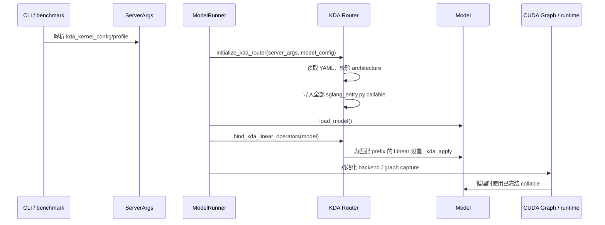

# KDA 实现结构与接入逻辑

## 1. 定位与边界

KDA 是 SGLang worker 进程内的只读算子路由层。它解决的是“当前模型的某个
SGLang 调用点应该调用哪个外部 adapter”，不解决“哪个候选最快”或“如何把
SGLang tensor 转成某个 llm_flops 实现需要的布局”。

KDA 负责：

- 从 `ServerArgs` 获取配置路径和 profile；
- 读取并校验 YAML v1；
- 精确校验 Hugging Face architecture；
- 从绝对 `root` 导入 `sglang_entry.py:callable`；
- 在模型加载后按完整 module prefix 静态绑定 Linear；
- 为 C4、DSA、attention 和 MoE 调用点提供固定 callable；
- 保证已配置 adapter 的异常原样传播。

KDA 不负责：

- tensor shape、dtype、layout、scale 或容差检查；
- 自动选择、排名或 benchmark candidate；
- 运行时回退、重试、shadow execution 或热更新；
- 修改 CUDA Graph 策略；
- 调用 llm_flops benchmark harness；
- 为缺失的 GLM-5.2 candidate 提供占位实现。

## 2. 代码布局

| 文件或目录 | 职责 |
|---|---|
| `python/sglang/srt/server_args.py` | 定义两个 KDA CLI 字段 |
| `python/sglang/srt/kda/router.py` | YAML 解析、entrypoint 导入、不可变状态、查询和 Linear binder |
| `python/sglang/srt/kda/__init__.py` | 暴露精简的 KDA 公共接口 |
| `python/sglang/srt/model_executor/model_runner.py` | 在模型加载前初始化 router，在模型加载后绑定 Linear |
| `python/sglang/srt/layers/linear.py` | 保存每个 Linear 的完整 `prefix` |
| `python/sglang/srt/layers/quantization/fp8.py` | FP8 Linear 的 `_kda_apply` 直接分支 |
| `python/sglang/srt/layers/quantization/unquant.py` | BF16/unquantized Linear 的 `_kda_apply` 直接分支 |
| `python/sglang/srt/layers/attention/dsv4/` | DeepSeek V4 C4/indexer 固定调用点 |
| `python/sglang/srt/layers/attention/deepseek_v4_backend.py` | DeepSeek V4 稀疏 attention 和 SWA 调用点 |
| `python/sglang/srt/layers/attention/dsa/dsa_indexer.py` | GLM-5.2 paged DSA index score 调用点 |
| `python/sglang/srt/layers/attention/dsa_backend.py` | GLM-5.2 稀疏 attention 调用点 |
| `python/sglang/srt/layers/moe/moe_runner/deep_gemm.py` | 模型限定的两阶段 masked grouped GEMM |
| `python/sglang/srt/kda/ADAPTER_PROTOCOL.md` | 每个 slot 的精确关键字 ABI |
| `examples/kda/` | YAML、启动和 benchmark 示例 |
| `test/registered/unit/kda/` | CPU 可运行的路由、AST、协议和 CLI 测试 |

KDA 没有修改全局
`python/sglang/srt/layers/deep_gemm_wrapper/entrypoint.py`，也没有给 Torch
安装全局 hook。

## 3. 启动生命周期



`ModelRunner.initialize()` 中的关键顺序是：

```python
initialize_kda_router(self.server_args, self.model_config)
self.load_model()
bind_kda_linear_operators(self.model)
```

因此：

- YAML 和 Python adapter 导入早于模型推理及 CUDA Graph capture；
- Linear 只有在完整模型及 prefix 已构造后才匹配；
- graph capture 和 replay 使用同一个 callable；
- 运行中不会重新读取 YAML，也不会切换 profile。

若 adapter 需要加载扩展或 JIT 编译，应在 `sglang_entry.py` 导入期或其自行管理的
capture 前准备阶段完成。KDA 不会因为 adapter 不兼容 CUDA Graph 而自动关闭
graph 或切回 eager/native。

## 4. CLI 与 profile

`ServerArgs` 新增：

```python
kda_kernel_config: Optional[str] = None
kda_kernel_profile: str = "off"
```

dataclass 的现有 CLI 机制自动生成：

```text
--kda-kernel-config
--kda-kernel-profile
```

状态行为：

| config | profile | 行为 |
|---|---|---|
| 未设置 | `off` | 完全原生，不读取 YAML |
| 已设置 | `off` | 完全原生，不读取 YAML |
| 未设置 | 非 `off` | 启动失败 |
| 已设置 | YAML 中不存在的 profile | 启动失败 |
| 已设置 | architecture 不匹配 | 启动失败 |
| 已设置 | 有效 profile | 加载并冻结该 profile |

`one_batch` 和 `offline_throughput` 已复用 `ServerArgs.add_cli_args`；
`launch_server` 通过 `prepare_server_args` 使用同一 parser，因此无需给每个
benchmark 重复添加参数。serving benchmark 是客户端，只需让被测 server
携带 KDA 参数。

## 5. YAML v1

最小结构：

```yaml
version: 1

profiles:
  deepseek_v4_best:
    architecture: DeepseekV4ForCausalLM
    operators:
      deepseek_v4.fp8_gemm_nt:
        operator_id: deepseek_v4_fp8_gemm_nt
        root: /absolute/path/to/operator_export
        entrypoint: sglang_entry.py:run
        targets:
          - model.layers.*.self_attn.wqkv_a
```

字段：

| 字段 | 说明 |
|---|---|
| `version` | 当前固定为 `1` |
| `profiles.<name>.architecture` | 必须与 `hf_config.architectures[0]` 精确相等 |
| `operators.<slot>` | SGLang 固定调用点的稳定标识 |
| `operator_id` | 外部算子 ID，仅用于日志和追踪 |
| `root` | 含 adapter 的绝对目录，必须存在 |
| `entrypoint` | `<root 下相对 Python 文件>:<callable>` |
| `targets` | 仅 Linear route 使用的完整 module prefix glob |

router 会把 `root` 解析为真实绝对路径，拒绝逃出 `root` 的 entrypoint 文件，
使用唯一 module 名导入 callable，然后把 route 保存到只读映射中。

YAML 不包含 shape 表、性能数据、容差、fallback 策略或 CUDA Graph 配置。一个
slot 如果需要按 M、batch 或 layout 选择多个候选，选择逻辑应位于该 slot 的
`sglang_entry.py`。

## 6. Router 状态与查询

`router.py` 使用冻结 dataclass 保存当前 worker 的：

- profile 名；
- 精确 architecture；
- `slot -> KdaOperatorRoute` 的 `MappingProxyType`；
- 启动期选定的模型专用 MoE callable。

公共查询接口：

```python
initialize_kda_router(server_args, model_config)
bind_kda_linear_operators(model)
get_kda_operator(slot)
get_kda_operator_for_architecture(slot, architecture)
get_kda_moe_operator()
kda_enabled()
```

`get_kda_operator_for_architecture` 用于共享 DSA 实现，只有调用方确认的
architecture 与 router 初始化时的 architecture 精确一致才返回 callable。
MoE slot 则在 router 初始化时由 architecture 固定：

| architecture | MoE slot |
|---|---|
| `DeepseekV4ForCausalLM` | `deepseek_v4.moe` |
| `GlmMoeDsaForCausalLM` | `glm52.moe_masked_grouped_gemm` |

## 7. Linear 静态绑定

### 7.1 绑定过程

`LinearBase` 保存构造时的完整 `prefix`。模型加载完成后，binder 只遍历一次
`model.modules()`：

1. 找到带字符串 `prefix` 的 module；
2. 只保留与当前 architecture 相符的模型专用 Linear slot；
3. 用 `fnmatchcase` 匹配 YAML `targets`；
4. 给第一个匹配 route 设置：

   ```python
   module._kda_apply = route.callable
   ```

已限定的 Linear slot：

| slot | architecture |
|---|---|
| `deepseek_v4.fp8_gemm_nt` | `DeepseekV4ForCausalLM` |
| `glm52.dsa_projection` | `GlmMoeDsaForCausalLM` |
| `glm52.dsa_indexer` | `GlmMoeDsaForCausalLM` |

### 7.2 热路径

FP8 和 BF16/unquantized quant method 的 `apply` 开头只有：

```python
kda_apply = getattr(layer, "_kda_apply", None)
if kda_apply is not None:
    return kda_apply(layer=layer, x=x, bias=bias)
```

热路径不读取 YAML、不做 glob、不扫描目录，也不重新选择候选。adapter 返回值
直接成为原 quant method 的返回值；adapter 抛错后不会继续执行原生 quant
method。

## 8. 固定调用点

### 8.1 DeepSeek V4

DeepSeek V4 调用点位于模型专用 C4/indexer 和 attention backend 内，因此不会
影响其他模型：

| slot | 主要调用位置 |
|---|---|
| `deepseek_v4.indexer_fp8_quant` | `dsv4/indexer.py::C4Indexer.compute_q` |
| `deepseek_v4.paged_mqa_logits` | `dsv4/indexer.py::forward_c4_indexer` |
| `deepseek_v4.topk_transform` | `dsv4/indexer.py` top-k transform |
| `deepseek_v4.sparse_prefill_attention` | `deepseek_v4_backend.py::_forward_prefill_sparse` |
| `deepseek_v4.sparse_decode_attention` | `deepseek_v4_backend.py` decode 分支 |
| `deepseek_v4.dense_swa_attention` | `deepseek_v4_backend.py` SWA 分支 |
| `deepseek_v4.moe` | `moe_runner/deep_gemm.py` |

FP4 paged indexer 保持原生；`deepseek_v4.paged_mqa_logits` 只替换 FP8 paged
路径。所有 adapter 调用使用关键字参数，且没有 `try/except` fallback。

### 8.2 GLM-5.2

GLM-5.2 的模型入口是 `GlmMoeDsaForCausalLM`，attention 实现复用
`deepseek_v2.py` 和共享 DSA backend。为了不影响其他继承者：

- `DeepseekV2AttentionMLA` 构造 Indexer 时只为 exact GLM-5.2、非 NextN
  实例缓存 `glm52.dsa_index_score`；
- `DeepseekSparseAttnBackend` 只为 exact GLM-5.2、非 draft worker 缓存
  `glm52.dsa_sparse_attention`；
- 推理热路径只判断已缓存属性是否为 `None`。

| slot | 主要调用位置 |
|---|---|
| `glm52.dsa_projection` | `deepseek_v2.py` 中匹配的 projection Linear |
| `glm52.dsa_indexer` | `dsa_indexer.py` 中匹配的 FP8/BF16 Linear |
| `glm52.dsa_index_score` | `Indexer._get_topk_paged` |
| `glm52.dsa_sparse_attention` | `DeepseekSparseAttnBackend._forward_flashmla_sparse` |
| `glm52.moe_masked_grouped_gemm` | `moe_runner/deep_gemm.py` |

`dsa_index_score` 把原生 `forward_batch.forward_mode` 对象作为 `phase`
传给 adapter；如何映射成 llm_flops 的 prefill/decode 约定由
`sglang_entry.py` 负责。

### 8.3 MoE

只修改 MoE runner 上层的两个 masked grouped GEMM 调用，不修改全局
DeepGEMM wrapper。`DeepGemmRunnerCore` 构造时捕获模型对应 callable：

```python
if self.kda_moe_operator is not None:
    result = self.kda_moe_operator(
        stage="gate_up",  # 第二处为 "down"
        lhs=...,
        rhs=...,
        out=...,
        routing=...,
        expected_m=...,
        ...
    )
else:
    result = deep_gemm_wrapper.grouped_gemm_nt_f8f8bf16_masked(...)
```

原生分支保留原参数、输出 buffer、overlap options 和返回值处理。adapter
分支失败时不会进入 `else`。

## 9. Adapter 接入

### 9.1 目录

```text
/absolute/path/operator_export/
├── implementation.py
├── sglang_entry.py
├── m1024/implementation.py   # 可选
├── m2048/implementation.py   # 可选
└── m4096/implementation.py   # 可选
```

KDA 只导入 YAML 指定的 entrypoint。`implementation.py` 可以保持 llm_flops
接口不变，SGLang 专用适配全部放进 `sglang_entry.py`。

### 9.2 Linear 示例

```python
def run(*, layer, x, bias=None):
    # 读取 layer.prefix、weight 和 scale。
    # 在此完成 layout/shape/candidate 分派。
    # 调用同目录 implementation.py。
    # 返回 SGLang 原 quant method 期望的 tensor。
    ...
```

固定调用点必须实现
[`ADAPTER_PROTOCOL.md`](../python/sglang/srt/kda/ADAPTER_PROTOCOL.md)
中对应 slot 的完整关键字协议。KDA 不调用 `supports()`、`validate()`、
`fallback()` 或 `can_run()`。

### 9.3 接入步骤

1. 在 llm_flops reference/candidate 目录完成单算子验证和 benchmark；
2. 保持 `implementation.py` 不变，增加 `sglang_entry.py`；
3. 按协议把 SGLang 关键字参数转换为 implementation 输入；
4. 若一个 slot 有多个 shape candidate，在 adapter 内分派；
5. 在部署 YAML 中增加该 slot、绝对 root 和 entrypoint；
6. 只为 Linear slot填写真实、完整 prefix glob；
7. 启动带 KDA profile 的 server；
8. 使用原 SGLang benchmark 对整模型进行对比。

不要把测试 fake adapter、归档结果或尚未导出的目录写入正式 YAML。

## 10. 失败语义

| 场景 | 结果 |
|---|---|
| profile 为 `off` | 不读配置，使用原生路径 |
| slot 未配置 | 该调用点使用原生路径 |
| YAML 结构或 version 错误 | 启动失败 |
| profile 不存在 | 启动失败 |
| architecture 不匹配 | 启动失败 |
| root/entrypoint/callable 无效 | 启动失败 |
| adapter import/JIT 失败 | 启动失败 |
| adapter 执行失败 | 当前推理或 server 直接失败 |
| adapter 不兼容 CUDA Graph | capture/replay 直接失败 |

“slot 未配置”是明确选择原生实现；“slot 已配置但失败”绝不被解释为回退条件。

## 11. Benchmark 接入

原生/off：

```bash
python -m sglang.benchmark.one_batch \
  --model-path /path/to/model \
  --kda-kernel-profile off \
  <其他参数>
```

KDA：

```bash
python -m sglang.benchmark.offline_throughput \
  --model-path /path/to/model \
  --kda-kernel-config /absolute/path/kda-routes.yaml \
  --kda-kernel-profile glm52_best \
  <其他参数>
```

Serving benchmark：

```bash
python -m sglang.launch_server \
  --model-path /path/to/model \
  --kda-kernel-config /absolute/path/kda-routes.yaml \
  --kda-kernel-profile deepseek_v4_best \
  <其他 server 参数>

python -m sglang.benchmark.serving <原有客户端参数>
```

客户端 benchmark 不读取 kernel YAML。切换原生/KDA 时重启 server，并保持其他
benchmark 参数一致。

## 12. 测试与验收

KDA 测试不需要真实模型权重或 GPU kernel：

```bash
python -m pytest -q test/registered/unit/kda
python -m compileall -q python/sglang/srt/kda test/registered/unit/kda
ruff check python/sglang/srt/kda test/registered/unit/kda
git diff --check
```

测试覆盖：

- `off`、缺失配置、未知 profile 和 architecture 错配；
- entrypoint 成功/失败导入；
- Linear 匹配、未匹配、重复绑定和 architecture 限定；
- DeepSeek V4、GLM-5.2、MoE 固定 slot 的参数及 native 分支；
- adapter 异常直接传播；
- `one_batch`、`offline_throughput` 和 `launch_server` 的 CLI 接线；
- serving benchmark 客户端不增加 KDA 参数。

这些测试只证明接入兼容性。正式算子的 correctness、容差、性能、CV、ranking、
SOL/MFU 等仍由 llm_flops 负责。

